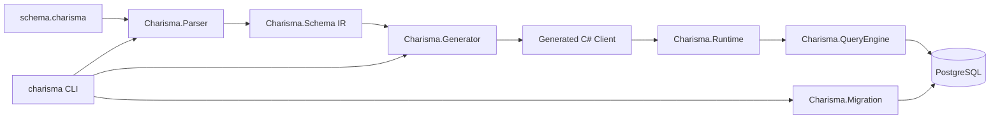

# CharismaORM

A strongly-typed, schema-first ORM toolkit for .NET, centered around code generation and a PostgreSQL query engine.

This README is intentionally detailed and grounded in what is implemented in this repository (`main`), including behavior verified by tests in `tests/*`.

## Table of Contents

- [1. What CharismaORM Is](#1-what-charismaorm-is)
- [2. Why CharismaORM](#2-why-charismaorm)
- [3. Current Capabilities Snapshot](#3-current-capabilities-snapshot)
- [4. Repository Architecture](#4-repository-architecture)
- [5. End-to-End Flow](#5-end-to-end-flow)
- [6. Quick Start](#6-quick-start)
- [7. CLI Reference (`charisma`)](#7-cli-reference-charisma)
- [8. Schema DSL Reference](#8-schema-dsl-reference)
- [9. Schema Modeling Patterns](#9-schema-modeling-patterns)
- [10. Generated Code: What You Get](#10-generated-code-what-you-get)
- [11. Runtime Usage](#11-runtime-usage)
- [12. Query Semantics (Planner + Executor)](#12-query-semantics-planner--executor)
- [13. Transactions](#13-transactions)
- [14. Migrations and Introspection](#14-migrations-and-introspection)
- [15. JSON Handling](#15-json-handling)
- [16. Metadata and Determinism](#16-metadata-and-determinism)
- [17. Error Model](#17-error-model)
- [18. Security and Safety Guarantees](#18-security-and-safety-guarantees)
- [19. Mermaid Diagrams](#19-mermaid-diagrams)
- [20. Package/Project Map](#20-packageproject-map)
- [21. Testing and Quality Signals](#21-testing-and-quality-signals)
- [22. Known Limitations and Planned Areas](#22-known-limitations-and-planned-areas)
- [23. Practical Recipes](#23-practical-recipes)
- [24. Appendix: Source Pointers](#24-appendix-source-pointers)

---

## 1. What CharismaORM Is

CharismaORM is a **schema-first ORM stack** for C# that combines:

- A custom schema DSL parser (`schema.charisma`) with semantic validation.
- A deterministic code generator that emits strongly-typed client code.
- A runtime and query engine that execute typed query models against PostgreSQL.
- Migration/introspection tooling for `db pull` and `db push` workflows.

The system is designed to make database usage feel like normal C# code, while preserving explicit schema ownership and deterministic generation.

## 2. Why CharismaORM

CharismaORM focuses on a developer experience where:

- Your schema is the source of truth.
- Generated API surfaces are strongly typed and model-specific.
- Query planning is explicit, parameterized, and validated.
- Runtime behavior is deterministic and testable.
- Migrations are safety-aware, with warning/unexecutable channels.

## 3. Current Capabilities Snapshot

Implemented in this repository today:

- PostgreSQL runtime provider.
- CLI with `generate`, `db pull`, `db push`.
- Typed operations:
  - `FindUnique`, `FindFirst`, `FindMany`
  - `Create`, `CreateMany`, `Update`, `UpdateMany`, `Upsert`
  - `Delete`, `DeleteMany`
  - `Count`, `Aggregate`, `GroupBy`
- Typed filters including relation filters and JSON filters.
- Select/include/omit projection system.
- Transaction APIs (scoped delegates, manual rollback support).
- Migration planner + runner with advisory locking and migration history.
- Schema introspection from PostgreSQL and schema file write/update tooling.

Not yet fully implemented in CLI:

- `charisma migrate ...` command family is present as planned but returns a not-implemented path.

## 4. Repository Architecture



Core projects:

- `src/Charisma.Schema`: Schema IR types, normalizer, schema hash.
- `src/Charisma.Parser`: DSL parser + semantic validator.
- `src/Charisma.Generator`: Roslyn-based C# code generator.
- `src/Charisma.QueryEngine`: query models, planner, executor, metadata contracts.
- `src/Charisma.Runtime`: runtime composition and provider selection.
- `src/Charisma.Migration`: PostgreSQL introspection, diff planning, push/reset, runner.
- `src/Charisma.Client`: CLI tool (`charisma`).
- `src/Charisma.All`: package aggregator (`CharismaORM`).

## 5. End-to-End Flow

1. Write/edit `schema.charisma`.
2. Parse and validate schema into `CharismaSchema`.
3. Generate typed C# client + args/filter/include/select/metadata artifacts.
4. Run your app with `CharismaRuntimeOptions`.
5. Generated delegates construct query models.
6. Query engine validates args, plans parameterized SQL, executes, materializes.
7. Optional: synchronize database with `charisma db pull` and `charisma db push`.

## 6. Quick Start

### Prerequisites

- .NET 8 SDK
- PostgreSQL
- A `schema.charisma` file

### Build

```bash
dotnet build Charisma.sln
```

### Generate client code

```bash
charisma generate schema.charisma ./Generated --root-namespace MyApp.Generated
```

### Push schema to database

```bash
charisma db push schema.charisma --connection "Host=localhost;Database=mydb;Username=postgres;Password=postgres"
```

### Use generated client

```csharp
using MyApp.Generated;
using Charisma.Runtime;

var options = new CharismaRuntimeOptions
{
    ConnectionString = "Host=localhost;Database=mydb;Username=postgres;Password=postgres",
    RootNamespace = "MyApp.Generated",
    Provider = ProviderOptions.PostgreSQL
};

using var client = new CharismaClient(options);
var rows = await client.Robot.FindManyAsync();
```

## 7. CLI Reference (`charisma`)

Entry point: `src/Charisma.Client/Program.cs`

### `charisma generate`

```text
charisma generate [schemaPath] [outputPath] [--root-namespace MyApp.Generated]
```

Defaults:

- `schemaPath`: `./schema.charisma`
- `outputPath`: `./Generated` or generator config output
- root namespace: generator config or `<cwd>.Generated`

Behavior:

- Parses schema with `RoslynSchemaParser`.
- Builds generator options.
- Runs `CharismaGenerator.Generate(...)`.

### `charisma db pull`

```text
charisma db pull [schemaPath] [--connection <conn>] [--force]
```

Connection resolution order:

1. `--connection`
2. `CHARISMA_CONNECTION_STRING` or `DATABASE_URL`
3. datasource URL in schema (including `env("VAR")` patterns)

Behavior:

- Introspects PostgreSQL schema.
- If file absent/empty/forced: writes full schema.
- Else: updates datasource block in-place.

### `charisma db push`

````text
# CharismaORM

Schema-first, strongly typed ORM tooling for .NET with PostgreSQL query execution and migration support.

The full documentation now lives in `docs/` as a multi-page docs-site style structure.

## Documentation

- Docs entry point: `docs/index.md`
- Optional MkDocs config: `mkdocs.yml`

## First-Timer Path

If you are new to CharismaORM, start here:

1. `docs/getting-started/quickstart.md`
2. `docs/getting-started/first-steps.md`
3. `docs/getting-started/mental-model.md`

## Main Guides

- `docs/core/schema-dsl.md`
- `docs/core/generation.md`
- `docs/core/runtime-client.md`
- `docs/core/queries.md`
- `docs/core/transactions.md`
- `docs/core/json.md`

## Operations

- `docs/operations/cli.md`
- `docs/operations/cli-roadmap.md`
- `docs/operations/migrations.md`
- `docs/operations/release-gates.md`

## Architecture

- `docs/architecture/overview.md`
- `docs/architecture/erd.md`

## Reference

- `docs/reference/capabilities-matrix.md`
- `docs/reference/error-reference.md`
- `docs/reference/project-map.md`
- `docs/reference/limitations.md`

## Minimal Quickstart

```bash
dotnet build Charisma.sln
charisma generate schema.charisma ./Generated --root-namespace MyApp.Generated
charisma db push schema.charisma --connection "Host=localhost;Database=mydb;Username=postgres;Password=postgres"
````

Then instantiate the generated client in your app:

```csharp
using MyApp.Generated;
using Charisma.Runtime;

var options = new CharismaRuntimeOptions
{
    ConnectionString = Environment.GetEnvironmentVariable("DATABASE_URL")!,
    RootNamespace = "MyApp.Generated",
    Provider = ProviderOptions.PostgreSQL
};

using var client = new CharismaClient(options);
var rows = await client.Robot.FindManyAsync();
```

## Status Snapshot

Implemented now:

- CLI: `charisma` (help), `generate`, `db pull`, `db push`
- Query operations: reads, writes, aggregate, groupBy
- Select/include/omit projection system (mutually exclusive; include support depends on operation path)
- Transactions and JSON support
- Migration planning/execution safety path

Not implemented yet:

- CLI `charisma migrate ...` command family
