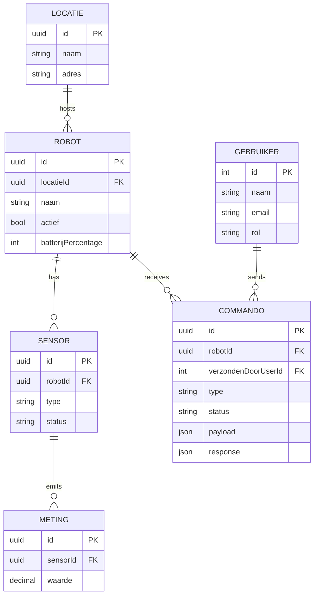

# Example ERD

This ERD reflects the schema style used in the repository examples.

## Notes

- Exact names/types depend on your schema file.
- Relation cardinality and nullable behavior depend on `@relation(...)` and optional markers.
