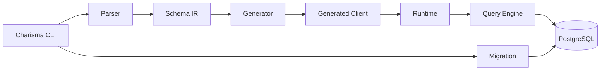

# Architecture Overview

## Component Graph

## Project Responsibilities

- `Charisma.Schema`:
  - model types and deterministic schema normalization/hash
- `Charisma.Parser`:
  - DSL parsing and semantic validation
- `Charisma.Generator`:
  - emitted typed C# API from schema
- `Charisma.Runtime`:
  - provider runtime setup and option handling
- `Charisma.QueryEngine`:
  - query model contracts, planning, execution, errors
- `Charisma.Migration`:
  - introspection, diffing, push/reset, migration runner
- `Charisma.Client`:
  - end-user CLI command entry points

## End-to-End Data Path

1. schema text parsed into IR
2. IR generates typed C# client
3. app calls generated delegates
4. delegates produce query models
5. planner emits SQL plans and parameters
6. executor runs SQL and maps rows

## Determinism

Determinism is a first-class goal:

- normalized schema canonical text
- stable schema hash
- deterministic generation order and output routing
