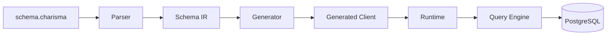

# Mental Model

This page explains how CharismaORM works internally, so you can reason about behavior and debugging.

## High-Level Pipeline

## Layer Responsibilities

- Parser:
  - Turns DSL text into validated in-memory schema objects.
- Schema IR:
  - Deterministic structure used by generator and runtime assumptions.
- Generator:
  - Emits typed C# API for each model.
- Runtime:
  - Composes provider-specific executor with options.
- Query Engine:
  - Plans parameterized SQL and materializes results.

## Why Generation Matters

The generated API gives compile-time guidance:

- known model names as properties
- known operations as methods
- known args/filter/select/include/omit types

This reduces stringly-typed query composition errors.

## Why Schema Hash Matters

The schema layer normalizes content and computes a hash.

This supports deterministic generation and traceability in output headers.

## Query Lifecycle

1. Your code calls a delegate method.
2. Delegate builds a query model (`QueryType`, model name, args payload).
3. Planner converts model into SQL plan + parameter list.
4. Executor runs SQL with parameters and maps rows back to generated types.

## Migration Lifecycle

1. Desired state comes from parsed schema.
2. Current state comes from DB introspection.
3. Planner computes ordered migration steps + warnings/unexecutable items.
4. Runner enforces safety gates and applies SQL in transaction.

## Key First-Timer Rule

If behavior surprises you, check this order:

1. Schema definition
2. Generated type signatures
3. Runtime options
4. Planned SQL and migration summary output
